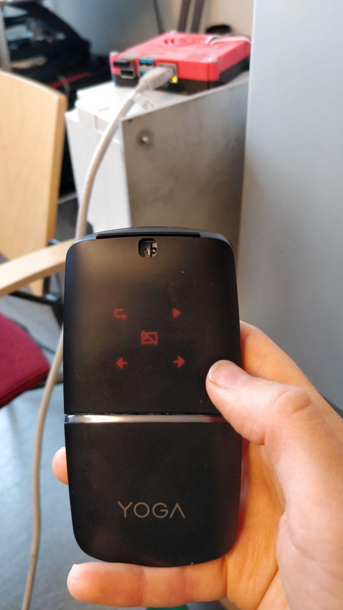
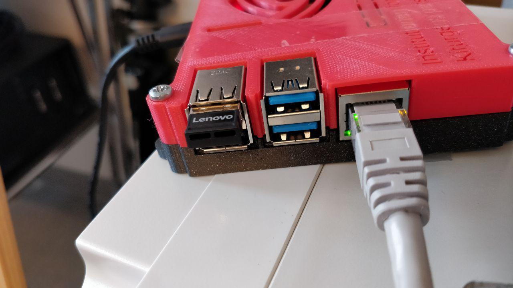

# pillar_control
This repository is for the pillar in used in Kirurgens perspektiv

# Run using remote or keyboard on rasperry

The Rasperry Pi is configured to login to a console and automatically run the cli.py script in /home/pi/pillar_control.

## Using the Lenovo mouse as a remote
The script cli.py is a command line interface where the lift can be controlled using a USB-keyboard or a Lenovo USB presenter mouse as remote. Use the left presenter button to go up and the right to go down. The Windows button on the backside of the mouse toggles volume controls, which do not work as a remote. 





## Change auto login to Desktop or Console
Use ssh to login to the Raspberry pi
```
ssh pi@192.168.1.12
```
and type the very secret password.

If the GUI is running, hit 'q' to quit.

In the terminal, write:
```
sudo raspi-config
```
In the configuration GUI, select 3. Boot options, then select B1. Desktop/CLI and then Console Autologin or Desktop.

## Autostarting script
Edit the ~.bashrc script:
```
nano ~/.bashrc
```
and add the commands you want to run in the end of the file, e.g.:
```
python3 /home/pi/pillar_control/cli.py
```

# Run arrow_move with GUI on remote computer

Connect to raspberry pi:
```
ssh -Y pi@192.168.1.12
```
Type password.

Navigate to this folder:
```
cd pillar_control
```

```
Run python3 script:
```

```
python3 arrow_move.py
```

The program is running! Use arrow keys (up and down) to control pillar. It assumes that the pillar is hanging from above.

Close the program:

Close GUI Window, or ctrl+c in terminal.

In terminal, type:
```
logout
```
